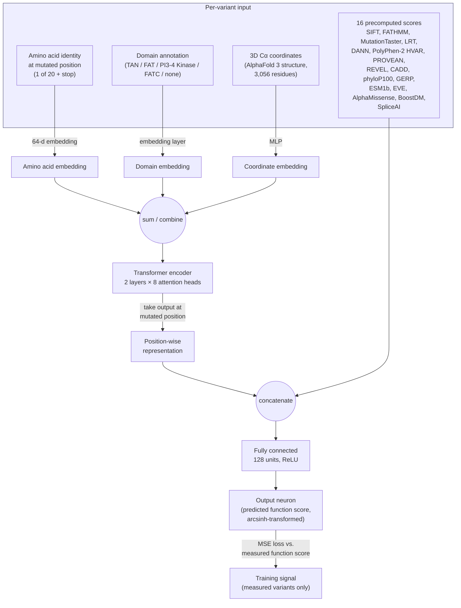

# DeepATM — Reconstruction

An independent, from-scratch reimplementation of **DeepATM**, the deep learning
model described in:

> Lee, K.S., Min, J.-G., Cheong, Y., Oh, H.-C., Park, J.-I., Song, M., Seo, J.H.,
> Cho, S.-R., Kim, H.H. (2025). *Functional assessment of all ATM SNVs using
> prime editing and deep learning.* **Cell** 188, 5081–5099.
> https://doi.org/10.1016/j.cell.2025.05.046

The original authors state that source code is "available upon request" — it
is not public. Everything in this repository was rebuilt from the paper's
**STAR★Methods** section ("Deep learning dataset and feature engineering",
"Model architecture", "Model training", "Performance evaluation",
"Predicting the effects of unevaluated ATM variants") and from Figure 6A,
plus the values published in the supplementary tables (Table S1–S5). It is a
**dry-lab reconstruction / study exercise**, not the authors' code, and
numerical results will not exactly reproduce the paper's — see
[Limitations](#limitations--honest-caveats) below.

> **Status: pre-first-result.** The pipeline runs end to end, but several
> defects make any current output untrustworthy — evaluation is in-sample, the
> auROC sign is inverted, feature normalisation leaks across folds, and the
> structural coordinates are fabricated. All are catalogued with fixes in
> [`EXECUTION_PLAN.md`](EXECUTION_PLAN.md) §4. Do not cite numbers from this
> repo until M5 lands.

## What DeepATM does

The paper experimentally measured the effect on cell fitness (a "function
score") of 23,092 of the 27,513 possible single-nucleotide variants (SNVs) in
the *ATM* gene, using prime editing + a PARP inhibitor (olaparib) selection
assay in HCT116 cells, followed by deep sequencing. Some regions of *ATM*
(mostly AT-rich sequence lacking an NGG PAM) could not be edited, leaving
4,421 SNVs unmeasured.

**DeepATM** is a supervised regression model trained on the 23,092 measured
variants (function score = label) that predicts a function-score-like value
— called the **eDA score** once rank-calibrated against the real function
scores — for the 4,421 variants that couldn't be experimentally tested. This
combination (23,092 measured + 4,421 predicted) gives 100% coverage of all
possible *ATM* coding SNVs.

## Schematic



This mirrors Figure 6A of the paper: amino-acid, domain, and AlphaFold-derived
coordinate embeddings feed a 2-layer/8-head Transformer encoder; the encoder's
output at the mutated residue is concatenated with 16 externally computed
pathogenicity scores (including AlphaMissense) and passed through a small
feedforward head to regress the function score, trained with MSE loss.

## Repository layout

```
DeepATM-Reconstruction/
├── data/
│   ├── raw/                 # place Table S1 (mmc1.xlsx) etc. here — gitignored
│   └── processed/           # cached feature tensors — gitignored
├── src/
│   ├── data_prep.py         # load & split Table S1 into train/val/held-out
│   ├── features.py          # sequence, domain, structure, score featurization
│   ├── model.py              # DeepATM architecture (PyTorch)
│   ├── train.py              # 5-fold CV training loop
│   ├── evaluate.py           # Pearson/Spearman, auROC vs. ClinVar
│   └── predict.py            # generate eDA scores for unevaluated SNVs
├── notebooks/                # exploratory analysis
├── checkpoints/               # trained model weights — gitignored
├── outputs/                   # predictions / figures — gitignored
├── requirements.txt
└── LICENSE
```

## Getting the data

Elsevier/Cell Press supplementary tables are **not redistributed in this
repo** (see `.gitignore`) since they're under the journal's copyright. To run
the pipeline yourself:

1. Download the supplementary spreadsheets from the paper's page
   (`https://doi.org/10.1016/j.cell.2025.05.046` → Supplemental Information),
   or use your own copies of `mmc1.xlsx`–`mmc5.xlsx`.
2. Place them under `data/raw/`.
3. Run:

```bash
pip install -r requirements.txt
python -m src.data_prep         # parses Table S1 into train/val/held-out CSVs
python -m src.train              # 5-fold CV training
python -m src.evaluate           # correlations + auROC vs. ClinVar
python -m src.predict            # eDA scores for the 4,421 unevaluated SNVs
```

`Table S1` ("Combined scores (function scores + eDA scores) for all ATM
SNVs") already flags, per row, whether a variant's score was **experimentally
measured** or **DeepATM-predicted** (`DeepATM_predicted` column). This
reconstruction uses that split directly:

- `DeepATM_predicted == "No"` → experimentally measured function score →
  used as **training/validation** labels.
- `DeepATM_predicted == "Yes"` → the paper's actual DeepATM output → used
  here as a **reference/held-out set** to sanity-check this
  reconstruction's predictions against the published ones (not used for
  training).

Only 5 of the paper's 16 auxiliary scores (CADD, BoostDM, EVE, REVEL,
AlphaMissense) are present in Table S1. `src/features.py` handles missing
scores by mean/zero-imputation and documents where to plug in the rest (e.g.,
from dbNSFP v5.1) if you want a closer match to the original feature set.

### What reproduces exactly

Checked against `mmc1.xlsx` — four of the paper's five dataset counts come out
byte-for-byte:

| Quantity | Table S1 | Paper | |
|---|---|---|---|
| Measured coding SNVs | 23,092 | 23,092 | ✅ |
| DeepATM-predicted SNVs | 4,421 | 4,421 | ✅ |
| ClinVar ≥1★ missense test set | 116 | 116 | ✅ |
| Training missense | 16,275 | 16,275 | ✅ |
| Training nonsense | 1,183 | 1,183 | ✅ |
| Training synonymous | 4,857 | 4,395 | ❌ |

The `ClinVar_classification` column in Table S1 is already ≥1★-filtered, so the
paper's test set can be rebuilt without downloading ClinVar. The synonymous
discrepancy is unexplained — see `EXECUTION_PLAN.md` §1.

**Targets to reproduce:** 5-fold CV Pearson r ≈ 0.61; eDA ↔ function score
r = 0.70; auROC 0.95 on the n=116 test set.

## Limitations / honest caveats

This is a **best-effort reconstruction for a dry-lab/study project**, built
from a methods description rather than the authors' code, so treat it as an
educational reimplementation, not a validated clinical tool:

- Only 5/16 auxiliary pathogenicity scores are available from the public
  supplement; the rest need a separate download (dbNSFP) not included here.
- AlphaFold 3 coordinates for the full 3,056-residue ATM structure aren't
  published alongside the paper, and **AlphaFold DB has no ATM entry at all**
  (`AF-Q13315-F1` returns 404 — the protein is past the length cut-off). The
  substitute is a cryo-EM structure: PDB **8OXQ** or **7SID**, both ATM dimers
  with SIFTS coverage of UniProt 1–3056.
- ⚠️ **`src/features.py` is currently wrong on both counts.** It requests
  `8OXO`, which is a 12-residue synthetic peptide rather than ATM, and it falls
  back to a `synthetic_backbone()` helix — fabricated geometry that is then
  cached permanently. Any result produced before `EXECUTION_PLAN.md` M2 lands
  is trained on fake structural data. See §4 of that document for the full
  defect list.
- Exact hyperparameter values (embedding init, restart schedule, batch
  composition) are taken verbatim from STAR★Methods, but details not stated
  in the paper (e.g. exact random seeds, PyTorch version) are reconstructed
  choices.
- This is **not** intended for clinical variant interpretation. For that,
  use the published `Combined_score` / `Classification` columns in the
  paper's own Table S1, or contact the corresponding author
  (hkim1@yuhs.ac) for the original code and model weights.
