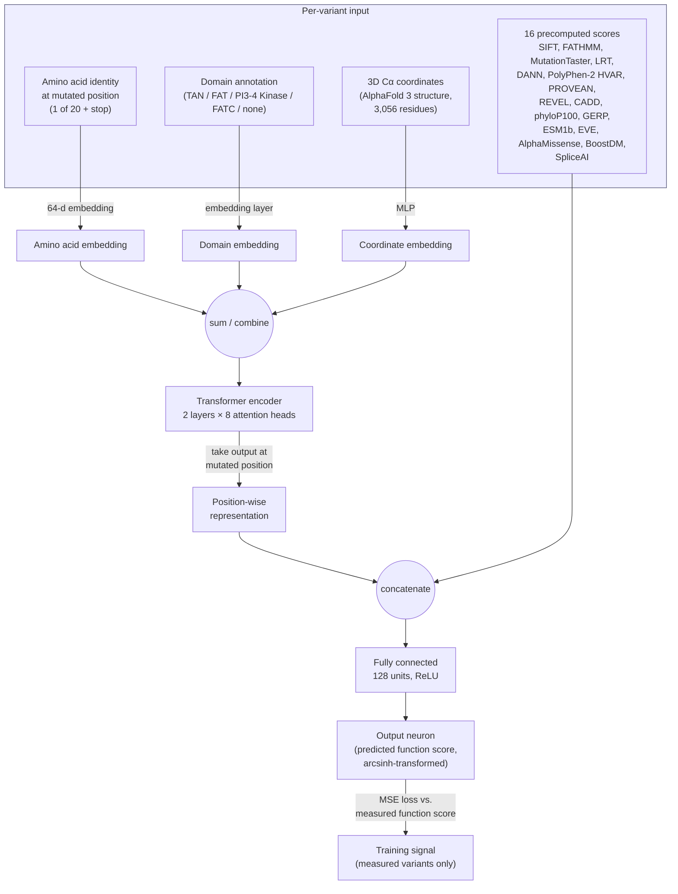

# DeepATM — Reconstruction

An independent, from-scratch reimplementation of **DeepATM**, the deep learning
model described in:

> Lee, K.S., Min, J.-G., Cheong, Y., Oh, H.-C., Park, J.-I., Song, M., Seo, J.H.,
> Cho, S.-R., Kim, H.H. (2025). *Functional assessment of all ATM SNVs using
> prime editing and deep learning.* **Cell** 188, 5081–5099.
> https://doi.org/10.1016/j.cell.2025.05.046

The original authors state that source code is "available upon request" — it
is not public. Everything in this repository was rebuilt from the paper's
**STAR★Methods** section ("Deep learning dataset and feature engineering",
"Model architecture", "Model training", "Performance evaluation",
"Predicting the effects of unevaluated ATM variants") and from Figure 6A,
plus the values published in the supplementary tables (Table S1–S5). It is a
**dry-lab reconstruction / study exercise**, not the authors' code, and
numerical results will not exactly reproduce the paper's — see
[Limitations](#limitations--honest-caveats) below.

> **Status: pipeline complete, awaiting a full-scale run.** Milestones M0–M7 of
> [`EXECUTION_PLAN.md`](EXECUTION_PLAN.md) have landed: the paper's splits are
> reproduced exactly, coordinates come from a real cryo-EM structure, feature
> normalisation is fitted per fold on training rows only, correlations are
> out-of-fold, and the auROC sign is fixed. Every defect in §4 of that document
> is closed.
>
> The ClinVar ≥2★ test subset is now built too, from a pinned release — the
> join recovers all 116 ≥1★ test variants and yields **n = 70** against the
> paper's 68, the two extra being ClinVar's growth since their ~2024 snapshot
> ([D5](#deviations-from-the-paper)).
>
> What has **not** happened yet is a full-length, full-data training run — the
> numbers in `outputs/` come from short windowed smoke runs on a CPU and are
> not comparable to the paper (see [D8](#deviations-from-the-paper)). Treat the
> code as ready and the results as not yet produced. The run itself is a single
> unattended command on any GPU, a few hours:
> [`docs/kaggle-gpu-run.md`](docs/kaggle-gpu-run.md) does it free on Kaggle
> (notebook: [`notebooks/kaggle_deepatm.ipynb`](notebooks/kaggle_deepatm.ipynb)),
> and [`docs/aws-gpu-run.md`](docs/aws-gpu-run.md) does it on a rented AWS
> instance for ~$3–6. Either way the command is `./scripts/run_full.sh`.

## What DeepATM does

The paper experimentally measured the effect on cell fitness (a "function
score") of 23,092 of the 27,513 possible single-nucleotide variants (SNVs) in
the *ATM* gene, using prime editing + a PARP inhibitor (olaparib) selection
assay in HCT116 cells, followed by deep sequencing. Some regions of *ATM*
(mostly AT-rich sequence lacking an NGG PAM) could not be edited, leaving
4,421 SNVs unmeasured.

**DeepATM** is a supervised regression model trained on the 23,092 measured
variants (function score = label) that predicts a function-score-like value
— called the **eDA score** once rank-calibrated against the real function
scores — for the 4,421 variants that couldn't be experimentally tested. This
combination (23,092 measured + 4,421 predicted) gives 100% coverage of all
possible *ATM* coding SNVs.

## Schematic



This mirrors Figure 6A of the paper: amino-acid, domain, and AlphaFold-derived
coordinate embeddings feed a 2-layer/8-head Transformer encoder; the encoder's
output at the mutated residue is concatenated with 16 externally computed
pathogenicity scores (including AlphaMissense) and passed through a small
feedforward head to regress the function score, trained with MSE loss.

## Repository layout

```
DeepATM-Reconstruction/
├── data/
│   ├── raw/                 # place Table S1 (mmc1.xlsx) etc. here — gitignored
│   └── processed/           # cached feature tensors — gitignored
├── src/
│   ├── data_prep.py         # Table S1 -> the paper's train/test/predict splits
│   ├── features.py          # sequence, domain, structure, score featurization
│   ├── dataset.py           # per-variant tensors + shared per-residue tracks
│   ├── model.py             # DeepATM architecture (PyTorch)
│   ├── train.py             # 5-fold CV training loop, out-of-fold predictions
│   ├── evaluate.py          # Pearson/Spearman, auROC vs. ClinVar, baselines
│   ├── predict.py           # eDA scores for the 4,421 unevaluated SNVs
│   ├── baseline_rf.py       # random-forest baseline (M6)
│   └── compare_runs.py      # paired comparison of two runs, e.g. the ablation
├── tests/                   # pytest; no data files or network required
├── notebooks/               # exploratory analysis
├── checkpoints/             # trained model weights — gitignored
├── outputs/                 # predictions / metrics — gitignored
├── requirements.txt
└── LICENSE
```

## Getting the data

Elsevier/Cell Press supplementary tables are **not redistributed in this
repo** (see `.gitignore`) since they're under the journal's copyright. To run
the pipeline yourself:

1. Download the supplementary spreadsheets from the paper's page
   (`https://doi.org/10.1016/j.cell.2025.05.046` → Supplemental Information),
   or use your own copies of `mmc1.xlsx`–`mmc5.xlsx`.
2. Place them under `data/raw/`.
3. Run:

```bash
pip install -r requirements.txt
pytest tests/                    # offline sanity checks; no data files needed

python -m src.data_prep          # Table S1 -> train / test / predict / measured
python -m src.clinvar            # pinned ClinVar release -> the >=2-star subset
python -m src.train --full-length  # 5-fold CV, the paper's setting (needs a GPU)
python -m src.evaluate           # out-of-fold correlations + auROC vs. ClinVar
python -m src.predict            # eDA scores for the 4,421 unevaluated SNVs
```

Or run the whole thing unattended, which is what
[`docs/kaggle-gpu-run.md`](docs/kaggle-gpu-run.md) (free, Kaggle's GPU tier) and
[`docs/aws-gpu-run.md`](docs/aws-gpu-run.md) (a rented AWS instance) each walk
through end to end:

```bash
./scripts/run_full.sh            # splits -> ClinVar -> train -> ablation
                                 # -> evaluate -> RF baseline -> eDA -> archive
```

Training checkpoints every epoch, so an interrupted run — spot reclamation,
dropped SSH, OOM, a Kaggle session hitting its 12-hour cap — is continued by
issuing the same command again. Completed
folds are skipped and the in-progress fold restarts from its last epoch; a
resumed run reproduces an uninterrupted one bit-for-bit
(`tests/test_train.py`).

A CPU smoke run of the whole pipeline, which finishes in a few minutes and
verifies the plumbing without claiming anything:

```bash
EPOCHS=2 SMOKE=1 ./scripts/run_full.sh
```

The two falsification checks from `EXECUTION_PLAN.md` M6 — a random forest on
the same scores, and the structural ablation:

```bash
python -m src.baseline_rf                                    # expect r ~0.55
python -m src.train --tag full                               # with coordinates
python -m src.train --no-coordinates --tag nocoord           # without
python -m src.compare_runs outputs/oof_predictions_full.csv \
                           outputs/oof_predictions_nocoord.csv \
                           --label-a coords --label-b nocoord
```

Both runs of the ablation must use the same `--seed` and `--folds`, or the
comparison is not paired; `compare_runs` refuses to proceed if they differ.

`Table S1` ("Combined scores (function scores + eDA scores) for all ATM
SNVs") already flags, per row, whether a variant's score was **experimentally
measured** or **DeepATM-predicted** (`DeepATM_predicted` column). This
reconstruction uses that split directly:

- `DeepATM_predicted == "No"` → experimentally measured function score →
  used as **training/validation** labels.
- `DeepATM_predicted == "Yes"` → the paper's actual DeepATM output → used
  here as a **reference/held-out set** to sanity-check this
  reconstruction's predictions against the published ones (not used for
  training).

Only 5 of the paper's 16 auxiliary scores (CADD, BoostDM, EVE, REVEL,
AlphaMissense) are present in Table S1. `src/features.py` keeps the column
order fixed at 16 and pairs every score with a **missingness indicator**, so
an imputed value is never indistinguishable from a genuinely average one — a
mean-imputed SIFT score for a synonymous variant is a fabricated number the
model would otherwise happily fit. The remaining 11 columns come through as
zero-with-flag until a dbNSFP v5.1 slice is joined in; see
`EXECUTION_PLAN.md` §2.1 for how.

### What reproduces exactly

Checked against `mmc1.xlsx` — four of the paper's five dataset counts come out
byte-for-byte:

| Quantity | Table S1 | Paper | |
|---|---|---|---|
| Measured coding SNVs | 23,092 | 23,092 | ✅ |
| DeepATM-predicted SNVs | 4,421 | 4,421 | ✅ |
| ClinVar ≥1★ missense test set | 116 | 116 | ✅ |
| Training missense | 16,275 | 16,275 | ✅ |
| Training nonsense | 1,183 | 1,183 | ✅ |
| Training synonymous | 5,031 | 4,395 | ❌ |

The `ClinVar_classification` column in Table S1 is already ≥1★-filtered, so the
paper's test set can be rebuilt without downloading ClinVar — selecting missense
rows with a P/LP/B/LB classification yields exactly 116 variants at 103 distinct
amino-acid positions.

Synonymous is the one count that does not reproduce, and the two published
numbers it has to satisfy are mutually inconsistent. The paper says the
shared-position exclusion applies to "all evaluated variants", but applying it
to nonsense gives 1,148 against the paper's 1,183; applying it to missense only
gives 1,183 exactly. `data_prep.py` therefore defaults to the missense-only
reading, which matches two of the three published counts and leaves synonymous
at 5,031 (`--position-exclusion coding` gives the stricter reading: 4,857
synonymous, 1,148 nonsense). Neither route reaches 4,395; the remaining ~600
are unexplained by stop-codon exclusion, by deduplication on amino-acid change,
or by ClinVar status — all three were tested. See `EXECUTION_PLAN.md` §1.

**Targets to reproduce:** 5-fold CV Pearson r ≈ 0.61; eDA ↔ function score
r = 0.70; auROC 0.95 on the n=116 test set. Secondary, and the sharpest checks
on faithfulness: a random forest on the same scores should reach ≈0.55, and
removing the coordinate branch should cost measurable accuracy (p = 0.032 in
the paper).

## Limitations / honest caveats

This is a **best-effort reconstruction for a dry-lab/study project**, built
from a methods description rather than the authors' code, so treat it as an
educational reimplementation, not a validated clinical tool:

- Only 5/16 auxiliary pathogenicity scores are available from the public
  supplement; the rest need a separate download (dbNSFP) not included here.
- AlphaFold 3 coordinates for the full 3,056-residue ATM structure aren't
  published alongside the paper, and **AlphaFold DB has no ATM entry at all**
  (`AF-Q13315-F1` returns 404 — the protein is past the length cut-off). The
  substitute is PDB **7SID**, a 2.53 Å cryo-EM ATM dimer whose SEQRES is
  exactly the 3,056-residue ATM sequence, so mmCIF `label_seq_id` is the
  UniProt position with no offset — verified by matching all 2,773 modelled
  residues against UniProt Q13315 (2,773/2,773 identical). The chain is
  selected by that identity check, not by chain name, because 7SID also
  contains nibrin (NBN) and an earlier version of this code let NBN residues
  into the ATM coordinate track.
- Residues unmodelled in the cryo-EM map are **masked**, and the coordinate
  MLP sees an explicit "not resolved" channel. There is deliberately no
  synthetic-backbone fallback: a fabricated helix teaches the model a geometry
  that does not exist, and does so silently.
- The four baselines the paper compares against (AlphaMissense, ESM1b, phyloP,
  PROVEAN) are also **model inputs**. The comparison in `outputs/metrics.json`
  therefore measures "does the transformer add anything on top of its own
  features", not independent superiority. It is reported as the paper does,
  with that caveat attached.
- Exact hyperparameter values (embedding init, restart schedule, batch
  composition) are taken verbatim from STAR★Methods, but details not stated
  in the paper (e.g. exact random seeds, PyTorch version) are reconstructed
  choices.
- This is **not** intended for clinical variant interpretation. For that,
  use the published `Combined_score` / `Classification` columns in the
  paper's own Table S1, or contact the corresponding author
  (hkim1@yuhs.ac) for the original code and model weights.

## Deviations from the paper

Every place this reconstruction is knowingly not the paper. Maintained
alongside `EXECUTION_PLAN.md` §7.

| # | Deviation | Why | Effect |
|---|---|---|---|
| D1 | Training synonymous n=5,031, not 4,395 | The paper's own counts are inconsistent about which consequences the shared-position rule covers | ~14% larger synonymous set; synonymous is 5% of each batch, so the effect on headline metrics is small |
| D2 | Coordinates from PDB 7SID, not AlphaFold 3 | AF3 model not deposited; AlphaFold DB has no ATM entry (verified 404) | 283 of 3,056 residues unmodelled and masked — the gap problem the paper used AF3 to avoid |
| D3 | Sinusoidal positional encoding added | Not specified in the paper; `nn.TransformerEncoder` has none, so the encoder otherwise has no ordinal sense of the sequence | Likely improves fit; documents a real ambiguity in the methods |
| D4 | dbNSFP score versions ≠ the paper's | The paper does not pin a dbNSFP release | Small shifts in the auxiliary features |
| D5 | ClinVar ≥2★ subset pinned to release 2026-08-08, not the paper's ~2024 snapshot | Table S1 carries no review-status column, so this test needs ClinVar itself; ClinVar is re-released weekly and grows | All 116 ≥1★ variants matched; **n=70** vs the paper's 68. Release date and SHA-256 recorded in `metrics.json` |
| D6 | Random seeds, PyTorch version, embedding init | Not stated | Run-to-run variance; report seed and mean ± sd over ≥3 seeds |
| D7 | Embeddings combined by summation | The paper says only "integrated with" | Concatenation + projection is an equally valid reading; untested |
| D8 | Windowed attention in CPU smoke mode | Full L=3,056 attention needs GPU memory | **Any windowed result is not comparable to the paper.** The window is printed with every run and stored in each checkpoint |
| D9 | 32 model inputs (16 scores + 16 missingness flags), not 16 | 11 of the 16 scores are absent entirely and 23–39% of the rest are undefined for synonymous variants | Prevents the model reading an imputed value as a real one; `ScoreImputer(with_flags=False)` restores the literal 16 |
